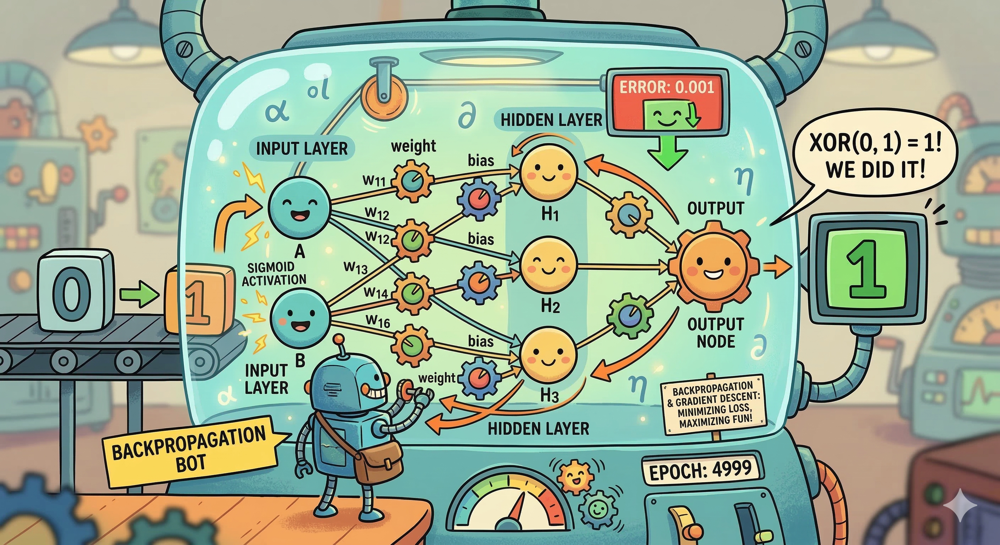
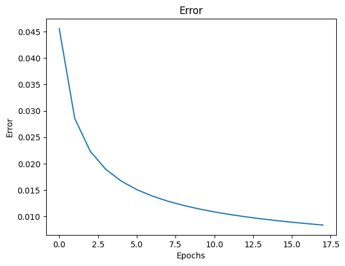

# Neural Network — Backpropagation on XOR



This project implements a simple **Artificial Neural Network trained using backpropagation** to solve the XOR problem.  
It demonstrates how a network learns by minimizing error over epochs.

---

## Overview

The XOR problem is a classic example that **cannot be solved by a linear model**, requiring a neural network with at least one hidden layer.

This notebook shows:

- Forward propagation (prediction)
- Backpropagation (learning)
- Error reduction over time

---

## Neural Network Computation

Each node computes:

### Weighted Sum
```
z = w · x + b
```

### Sigmoid Activation
```
σ(z) = 1 / (1 + e^{-z})
```

---

## Training (Backpropagation)

The network learns by minimizing error using gradient-based updates.

### Error (Loss)
```
E = (y_true - y_pred)^2
```

### Key Idea

- Compute prediction via forward propagation  
- Measure error  
- Propagate error backward  
- Update weights and biases  

---

## Code Structure

Main components:

- `initialize_network` → create layers with random weights  
- `forward_propagate` → compute predictions  
- `backpropagate_error` → compute gradients  
- `update_weights` → adjust parameters  

---

## Training Process

1. Initialize network
2. Loop over epochs:
   - Forward pass
   - Compute error
   - Backward pass
   - Update weights
3. Track error across epochs

---

## Results

The model successfully learns the XOR function.

### Error Reduction Over Time



- Error decreases rapidly in early epochs  
- Gradually converges as learning stabilizes  
- Indicates successful training via backpropagation  

---

## Running the Notebook

1. Clone repo
```
git clone https://github.com/yourusername/your-repository.git
```

2. Install dependencies
```
pip install numpy matplotlib
```

3. Run notebook
```
jupyter notebook
```

---

## Summary

This project demonstrates:

- Nonlinear learning with neural networks  
- Backpropagation for training  
- Error minimization over time  

A minimal but complete implementation of learning in neural networks.
````
